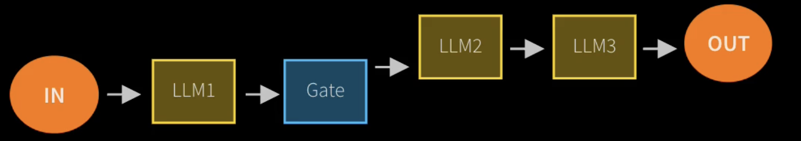
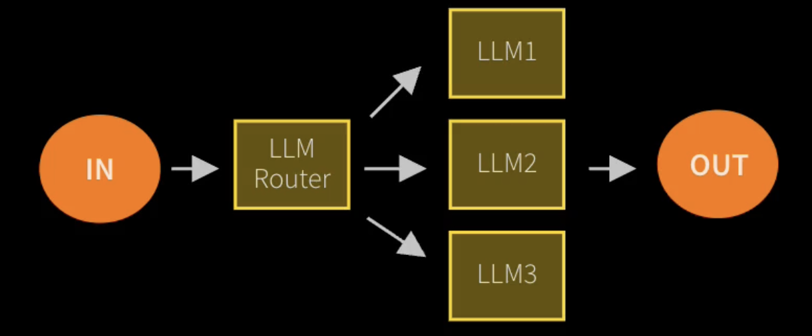
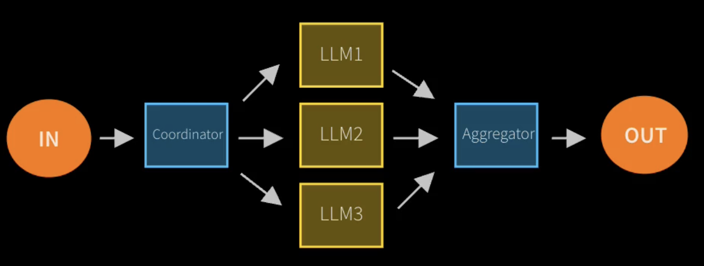
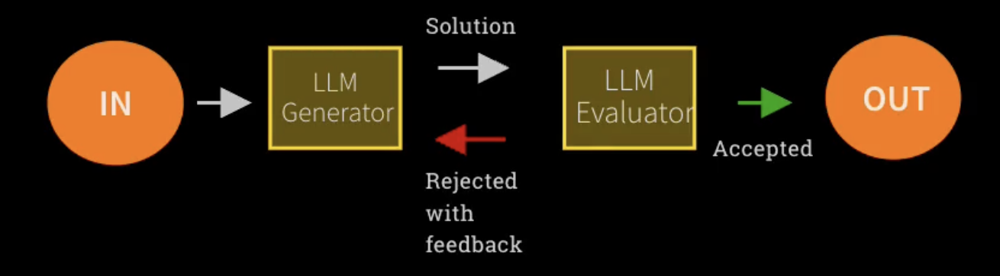

# Agents

## What is an agent?
AI Agents are programs where LLM outputs control the workflow - HuggingFace.

One output from LLM is able to decide what tasks are carried out in what sequence.

In general, AI solution or agentic AI involves any or all of these 5 hallmarks:
1. Multiple LLM calls.
2. LLM with the ability to use tools.
3. An environment where LLMs interact (send messages, coordination orchestration).
4. A planner to coordinate activities.
5. Autonomy (giving some ability to an LLM to control what order things happen; giving LLM the opportunity to decide how to carry out future actions).

## Agentic systems (two sub-fields of agentic AI)
*Anthropic* distinguishes two types of agentic systems:
1. *Workflows* are systems where LLMs and tools orchestrated through predefined code paths.
2. *Agents* are systems where LLMs dynamically direct their own processes and tool usage, maintaining control over how they accomplish tasks. 

## Five design patterns when budiling Agentic systems for workflow (Anthropic)
1. *Prompt chaining*: decompose into fixed sub-tasks. It has LLM carrying out some task and then potentially based on some code, then pass that to a second LLM and that output could move on to the third and so on. This is chaining a series of LLM calls, decomposing into a fixed set of subtask. This is good because we can take care to frame each LLM call very precisely to get the best, and the most effective LLM response based on that prompt while keeping the whole process and workflow on guardrails by taking it step by step through a sequence of well defined tasks. (Yellow boxes are calls to LLM and blue boxes is where some code/software is written).

2. *Routing*: direct an input into a specialized sub-task, ensuring separation of concerns. Inputs come in and an LLM has the task of deciding which of multiple possible models are selected to carry out this function. The idea is to have specialist models here (LLM1, LLM2, LLM3) and they are good at carrying out specific task, the LLM router's job is to classify the task, understand which of the specialists will be best equipped to tackle the task. This allows for separation of concerns for being able to have different LLMs that have different levels of expertise and have a LLM to route to these experts.

3 *Parallelization*: breaking down tasks and running multiple subtasks concurrently. The idea is to have some code that takes a task and break it down into multiple pieces that should all run in _parallel_, where the tasks are sent to three LLMs to carry out three different activities concurrently. The aggregator (code) then takes the answers and stitches them together. (The tasks dont have to be different, it could be the same task but carried out three times.)

4. *Orchestrator-worker*: complex tasks are broken down dynamically and combined. It is no longer code that is doing the orchestration, rather, it is an LLM. The idea is that we are using a model to break down a complex task into smaller steps and then using a LLM to combine the result, hence making it much more dynamic because the orchestrator (LLM) can choose how to divide up the task. This design pattern might be hard to be considered as a (fixed) workflow because the orchestrator (LLM) has autonomy to how to divide the tasks and choose how many different LLMs get assigned the activities.

5. *Evaluation-optimizer*: LLM output is validated by another. The first LLM Generator doing its job to generate a solution, and a second LLM Evaluator evaluates the work of the first LLM. The LLM Evaluator does not generate content, but instead, it checks the work of a prior LLM and then accept or reject (with reason).


_A key concern to building any production agentic systems with LLM is about accuracy, predictability, robustness of the response and having validation agents to increase accuracy and build more guarantees._

## Workflow agentic pattern:
The process is more:
1. *Open-ended*
2. *Feedback-loops*
3.. *No fixed path*

## Challenges in agentic system
1. No knowing how long it will take to complete the task.
2. Not knowing if it will complete the task.
3. Not knowing the quality of outputs.
3. Not knowing the cost.

## Risk of Agent frameworks
1. *Unpredictable path*: not knowing what order task will take place or what task will happen.
2. *Unpredictable output*: able to tackle complex problems, but unpredictable outputs.
3. *Unpredictable cost*: cost of running the API.
4. *Monitoring*: ways to monitor LLM / agent interactions.
5. *Guardrails*: ensures agents behave safely, consistently and within intended boundaries.

## Agentic AI framework
Frameworks provide a glue / abstraction code that takes away some of the details of interacting with LLMs and provide a nice and elegant framework for building agentic solutions and focusing on the business problem instead.
1. *No framework*: simply connect to LLMs using APIs and use that to orchestrate amongst LLMs. (Anthropic - building effective Agents, advocate using no frameworks and connecting to APIs directly because thes APIs are simple and straightforward. Users can see what is going on under the hood and control the prompts in detail.).
2. *Model Context Protocol*: an open source protocol that connect things together by allowing models to be connected to sources of data and tools, remove the need of glue code. Provides the ability to stitch models and providers in this simple way.
3. *OpenAI Agent SDK*: a new light-weight, simple and clean framework.
4. *Crew AI*: a light-weight and low code configuration that put agents to work on a problem only through configuration YAML file.
5. *LanGraph*: a heavy-weight to build computational graph for agents and tools.
6. *AutoGen*.

## Resources
We can provide resources (context, information) to LLM to improve its expertise. This also means shoving data relevant to the question into the prompt. *RAG* is a technique that is smart at picking relevant inform for the question.

## Tools
Tools give LLM the autonomy. It gives an LLM the power to carry out actions like *query a database* or *message other LLM*.
```
LLM ---response---> code ---execute---> task
```
In the prompts to LLM, we list out all the things the LLM can ask for, and make it respond in JSON which contains what the LLM wants to do.

1. *System prompt*: tends to be the overall instructions that sets the context for the task at hand, the format and the way it should respond.
2. *User prompt*: is the actual prompt that is coming from the user.

## Structured output
1. Use pydantic model

[Leaderboard](https://www.vellum.ai/llm-leaderboard)